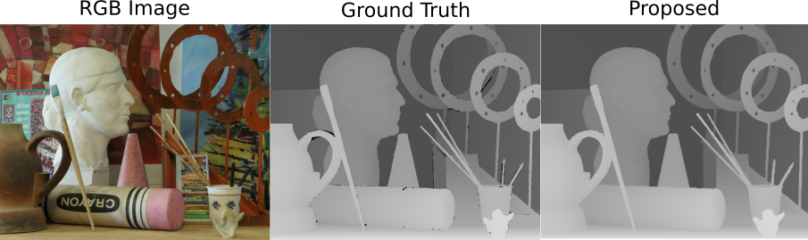

# Local-linear-fitting-based matting approach for joint hole filling and depth upsampling for RGB-D images



This repository contains MATLAB implementation associated with the paper

"Local-linear-fitting-based matting approach for joint hole filling and depth upsampling for RGB-D images"

Yanfu Zhang, [Li Ding](https://www.hajim.rochester.edu/ece/lding6), and [Gaurav Sharma](http://www2.ece.rochester.edu/~gsharma/)

Journal of Electronic Imaging (JEI), 2019

##  Dependencies
Requires all of the following:
* MATLAB (Tested on R2017b)
* MATLAB Image Processing Toolbox
* MATLAB Computer Vision Toolbox

## Running the Program
We recommend using the CodeOcean version of the program, which can be run using CodeOcean's built in interface. The code is available [here](https://doi.org/10.24433/CO.5593522.v1).


## Input and Output Data:
By default the code runs on a cropped version of one of the images in the Middlebury dataset, which is included in the project on CodeOcean. This allows the code to be run quickly and the corresponding results to be visualized. 
```
opt = get_default_opt('quick_demo')
```

The code can be run for a full-size image from the "Middlebury dataset" or for a full image from the "ToF dataset".
```
opt = get_default_opt('Middlebury')
opt = get_default_opt('Tof')
``` 
Error metrics reported in the paper for these full-size images can also be computed using the included code.

The ToF dataset has high levels of noise and the proposed approach is not directly designed to handle noise. Competitive results can, however, be obtained with the proposed methodd by denoising the input low resolution (with holes) dataset prior to upsampling and hole filling. The two alternative denoised inputs for each of the three images in the ToF dataset are also provided here. The three images are referred to as "Devil", "Shark", and "Books". The corresponding denoised inputs can be determined from the file names, for example, init_shark_1.mat and init_shark_2.mat are the two alternative denoised inputs that can be used for the Shark images. The required ground truth image for one of the sample images is also included.

## Acknowledgment

Sample datasets are included with this code to illustrate the operation and to allow the corresponding results in the paper to be reproduced. Only one example dataset is included with the code distribution; users should obtain the full images from the original sources, whom we thank for providing the data.

### The "Art" RGB Image and Accompanying Depth Image
The "Art" RGB image and accompanying depth image are obtained from the Middlebury (stereo) dataset which  provides high resolution RGB images of multiple views and corresponding disparity maps. The relevant papers are:

D. Scharstein and R. Szeliski, “High-accuracy stereo depth maps using structured light,” in IEEE Intl. Conf. Comp. Vision, and Pattern Recog., (2003).

D. Scharstein and C. Pal, “Learning conditional random fields for stereo,” in IEEE Intl. Conf. Comp. Vision, and Pattern Recog., (2007).

H. Hirschmüller and D. Scharstein, “Evaluation of cost functions for stereo matching,” in IEEE Intl. Conf. Comp. Vision, and Pattern Recog., (2007).

D. Scharstein, H. Hirschmüller, Y. Kitajima, G. Krathwohl, N. Nesic, X. Wang, and P. Westling, “High-resolution stereo datasets with subpixel-accurate ground truth,” in German Conf. Pattern Recognition, (2014).

The full "Middlebury dataset" used for obtaining the quantitative results reported in the paper were obtained from (URL is up-to-date as of the publication of the paper):

http://vision.middlebury.edu/stereo/data/scenes2005/


### The "Shark" Intensity Image and Accompanying Depth Image
The "Shark" intensity image and corresponding depth map were obtained from the "ToF dataset" provided with the following publication: 

 D. Ferstl, C. Reinbacher, R. Ranftl, et al., “Image guided depth upsampling using anisotropic total generalized variation,” in IEEE Intl. Conf. Comp. Vision., 993–1000 (2013).

The full "ToF dataset" used for obtaining the quantitative results reported in the paper (in the Discussion Section) was obtained from 
(URL is up-to-date as of the publication of the paper):

https://github.com/RobVisLab/tofmark

### Denoised Low Resolution Depth Maps
The two denoised low resolution depth maps (with missing regions in holes) were obtained for the "ToF dataset"  were obtained as follows: "denoised init 1" was obtained using the initialization data provided with Reference [20] in the paper (DGDE method), down-sampled and with the hole regions dropped out from the version provided. "denoised init 2" was obtained by using the method in Reference [17] in the paper (RCG method) as a denoising method, the high resolution depth map generated by that method was down-sampled and the hole regions were dropped.

## File/Directory Structure
```
JointDepthUpsampHoleFillLclLinMatting
├── code
│   ├── block_kernal_new.m
│   ├── comp_kernal_new.m
│   ├── denormalize_depth.m
│   ├── eval_depth_results.m
│   ├── get_default_opt.m
│   ├── load_data.m
│   ├── MainDepthUpsampleHoleFillLocalLinMat.m
│   ├── normalize_depth.m
│   ├── run_depth_upsample.m
│   ├── run_regular.m
│   └── zero_padding.m
├── data
│   ├── Middlebury
│   │   ├── art_color.png
│   │   ├── art_cropped_color.png
│   │   ├── art_cropped_depth.png
│   │   └── art_depth.png
│   └── ToF
│       ├── benchmarking_dataset_shark.mat
│       ├── init_books_1.mat
│       ├── init_books_2.mat
│       ├── init_devil_1.mat
│       ├── init_devil_2.mat
│       ├── init_shark_1.mat
│       └── init_shark_2.mat
├── README.md
└── results
```
